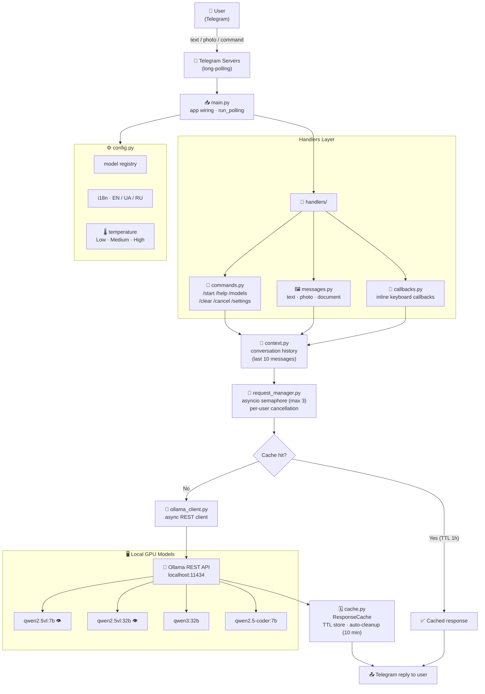

# 🤖 Local Chatbot AI

> A self-hosted Telegram bot powered by **Ollama** — run large language models (LLMs) locally on your GPU and chat with them right from Telegram.


---

## 🏗️ Architecture



---

## ✨ Features

| Feature | Details |
|---|---|
| 💬 **Multi-turn chat** | Keeps last 10 messages as context for coherent conversations |
| 🖼️ **Vision / VL models** | Send images; qwen2.5vl analyses them in detail |
| 🔄 **Response cache** | Repeated identical questions are answered from cache (1-hour TTL) |
| ⚡ **Async & concurrent** | Up to 3 parallel Ollama requests via asyncio semaphore |
| 🛑 **Request cancellation** | Cancel a slow inference mid-flight with /cancel |
| 🌡️ **Temperature control** | Low / Medium / High creativity via inline buttons |
| 🌍 **i18n** | English, Ukrainian, Russian UI |
| 🔧 **Hot model switch** | Switch between 6 pre-configured models without restart |
| 🧹 **Auto cache cleanup** | Background task clears expired entries every 10 minutes |

---

## 📂 Project Structure

```
Local_chatbot-AI/
├── main.py                  ← entry point, app wiring, run_polling
├── requirements.txt
├── .env.example
├── bot/
│   ├── config.py            ← constants, model registry, prompts, i18n
│   ├── cache.py             ← ResponseCache (TTL, stats)
│   ├── request_manager.py   ← semaphore limiter + per-user cancellation
│   ├── ollama_client.py     ← async Ollama REST client
│   ├── context.py           ← conversation history helpers
│   └── handlers/
│       ├── commands.py      ← /start /help /models /model /context ...
│       ├── messages.py      ← text, photo, document message handlers
│       └── callbacks.py     ← inline keyboard callbacks
├── tests/
│   └── test_cache.py        ← unit tests for ResponseCache
└── CHATBOT.py               ← original monolith (kept for reference)
```

---

## ⚙️ How It Works

1. The bot starts and listens via **long-polling** from Telegram servers.
2. Incoming messages are routed to the appropriate handler (`commands`, `messages`, or `callbacks`).
3. Conversation history (last 10 messages) is managed by `context.py`.
4. `request_manager.py` limits concurrent Ollama calls (max 3) and supports per-user cancellation.
5. `ollama_client.py` first checks the **response cache** — if found, returns instantly.
6. On cache miss, the request goes to the **local Ollama REST API** on `localhost:11434`.
7. The LLM response is stored in cache and sent back to the user via Telegram.

---

## 🚀 Quick Start

### 1. Prerequisites

- Python 3.11+
- [Ollama](https://ollama.com/) installed and running (`ollama serve`)
- At least one model pulled, e.g. `ollama pull qwen2.5vl:7b`
- A Telegram Bot token from [@BotFather](https://t.me/BotFather)

### 2. Clone & install

```bash
git clone https://github.com/Totsamuychel/Local_chatbot-AI.git
cd Local_chatbot-AI

python -m venv .venv
source .venv/bin/activate      # Windows: .venv\Scripts\activate

pip install -r requirements.txt
```

### 3. Configure

```bash
cp .env.example .env
# Edit .env and set your TELEGRAM_BOT_TOKEN
```

### 4. Run

```bash
python main.py
```

---

## 🤖 Supported Models

| Model | Vision | Description |
|---|---|---|
| `qwen2.5vl:7b` | ✅ | Fast, image-capable (default) |
| `qwen2.5vl:32b` | ✅ | Large, image-capable |
| `gpt-oss:20b` | ❌ | Powerful general-purpose |
| `qwen3:32b` | ❌ | Large text model |
| `qwen2.5-coder:7b` | ❌ | Coding specialist |
| `qwen2.5-coder:1.5b` | ❌ | Fast coding model |

Add more models in `bot/config.py` → `AVAILABLE_MODELS`.

---

## 📋 Telegram Commands

| Command | Description |
|---|---|
| `/start` | Start the bot, choose language |
| `/help` | Show all commands and system stats |
| `/models` | Browse and select a model interactively |
| `/model <name>` | Switch model by name |
| `/context` | Show conversation context stats |
| `/clear` | Clear conversation history |
| `/cancel` | Cancel in-progress inference |
| `/settings` | Adjust temperature and language |
| `/cache` | Show response cache statistics |

---

## 🛠️ Configuration

All constants are in `bot/config.py`:

| Variable | Default | Description |
|---|---|---|
| `OLLAMA_SERVER_URL` | `http://localhost:11434` | Ollama API base URL |
| `MAX_CONCURRENT_REQUESTS` | `3` | Max parallel LLM calls |
| `REQUEST_TIMEOUT` | `120 s` | HTTP timeout for Ollama |
| `CACHE_TTL` | `3600 s` | Cache entry lifetime |
| `MAX_CONTEXT_MESSAGES` | `10` | Messages kept in memory |
| `CLEANUP_INTERVAL` | `600 s` | Cache sweep interval |

---

## 💡 Improvement Roadmap

1. **Persistent storage** — save conversation history to SQLite/PostgreSQL so context survives restarts.
2. **Streaming responses** — use Ollama's `stream: true` to send partial answers token-by-token (feels much faster).
3. **Admin panel** — add an admin Telegram ID whitelist and a `/stats` command showing per-user usage.
4. **Multi-user isolation** — move `bot_data` context to Redis for horizontal scaling.
5. **Rate limiting** — per-user request quota to prevent abuse.
6. **Docker** — `docker-compose.yml` bundling the bot + Ollama for one-command deployment.
7. **Voice messages** — transcribe audio with Whisper (also runs locally via Ollama).
8. **Tool calling / function calling** — let models call local tools (calculator, web search, file reader).

---

## 🧪 Running Tests

```bash
pip install pytest
pytest tests/ -v
```

---

## 📄 License

MIT — do whatever you want, just keep the attribution.
